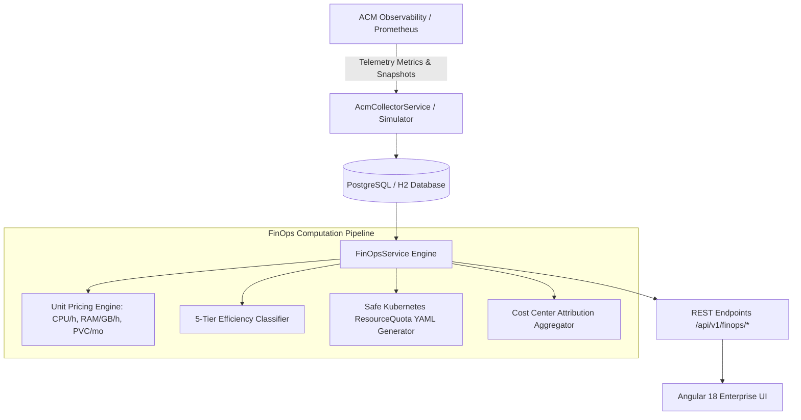

# OpenShift Operations Portal — FinOps & Rightsizing Engine

## 1. Executive Summary & Problem Statement

In enterprise multi-cluster OpenShift and Kubernetes deployments, application teams consistently over-request CPU and RAM resources for their namespaces. This practice leads to three major enterprise challenges:

1. **Massive Cloud & Hardware Waste**: Clusters appear "full" from a scheduling perspective (CPU/Memory Requests reaching 80-90%), forcing platform teams to procure additional worker nodes, VMware ESXi hosts, or cloud instances. In reality, actual resource usage often sits at 20-30%.
2. **Hidden Budget Drain**: Without automated cost attribution and rightsizing, IT leadership cannot quantify the exact dollar value of unused capacity or assign financial accountability to application cost centers.
3. **Out-of-Memory (OOM) & Throttling Blind Spots**: Conversely, under-provisioned services that burst above their quotas risk pod eviction (`OOMKilled`) or severe CPU throttling during peak business events.

The **FinOps & Rightsizing Engine** integrates with Red Hat Advanced Cluster Management (ACM) to continuously analyze namespace requests versus actual telemetry usage, quantify wasted spend, and generate actionable remediation manifests.

---

## 2. Core Architecture & Workflow



---

## 3. Mathematical Models & Algorithms

### 3.1 Cost Allocation Model

Costs are computed continuously using configurable unit pricing rates ($/hour for CPU & RAM, $/month for persistent storage):

$$\text{Monthly CPU Cost} = \text{Avg CPU Request (Cores)} \times \text{CPU Rate (\$/hour)} \times 730\text{ h}$$

$$\text{Monthly Memory Cost} = \text{Avg RAM Request (GB)} \times \text{RAM Rate (\$/GB/hour)} \times 730\text{ h}$$

$$\text{Monthly Storage Cost} = \text{PVC Request (GB)} \times \text{Storage Rate (\$/GB/month)}$$

$$\text{Total Monthly Allocated Spend} = \text{Monthly CPU Cost} + \text{Monthly Memory Cost} + \text{Monthly Storage Cost}$$

$$\text{Monthly Actual Cost} = (\text{Avg CPU Usage} \times \text{Rate}_{\text{CPU}} \times 730) + (\text{Avg RAM Usage} \times \text{Rate}_{\text{RAM}} \times 730) + \text{Cost}_{\text{Storage}}$$

$$\text{Monthly Wasted Spend} = \max(0, \text{Total Monthly Allocated Spend} - \text{Monthly Actual Cost})$$

### 3.2 Efficiency Rating Matrix

The overall efficiency score is a weighted blend of CPU efficiency (60%) and Memory efficiency (40%):

$$\text{Efficiency \%} = (0.6 \times \text{CPU Eff \%}) + (0.4 \times \text{Memory Eff \%})$$

Each namespace is automatically mapped into one of five operational tiers:

| Tier | Efficiency Score Range | Operational Diagnostic | Automated Action Recommended |
| :--- | :--- | :--- | :--- |
| **`SEVERE_WASTE`** | $< 30\%$ | Massive over-provisioning; 70%+ of allocated capacity is completely unused. | `DOWNSIZE_CPU_AND_RAM` immediately. |
| **`OVER_PROVISIONED`** | $30\% - 59.9\%$ | Generous quotas with substantial idle headroom. | `DOWNSIZE_CPU_AND_RAM` during next maintenance. |
| **`ACCEPTABLE`** | $60\% - 74.9\%$ | Moderate headroom; balance between stability and efficiency. | `MONITOR_USAGE`. |
| **`OPTIMAL`** | $75\% - 90\%$ | High efficiency; optimal utilization of enterprise infrastructure. | `NONE_MAINTAIN_CURRENT`. |
| **`UNDER_PROVISIONED`** | $> 90\%$ | Saturation risk; pods operate dangerously close to quota limits. | `INCREASE_REQUESTS_PREVENT_OOM` to avoid crashloops. |

### 3.3 Safe Rightsizing & Quota Remediation Calculation

To avoid instability or application crashes due to unexpected traffic spikes, the rightsizing recommendation does not reduce quotas down to bare average usage. Instead, it enforces a **25% Safety Buffer**:

$$\text{Recommended CPU (Cores)} = \text{RoundUp}(\text{Avg CPU Usage} \times 1.25)$$

$$\text{Recommended RAM (GB)} = \text{RoundUp}(\text{Avg RAM Usage} \times 1.25)$$

$$\text{Recommended CPU Limit} = \text{Recommended CPU} \times 2.0$$

$$\text{Recommended RAM Limit} = \text{Recommended RAM} \times 1.5$$

For every recommendation, the engine dynamically generates a validated Kubernetes `ResourceQuota` manifest:

```yaml
apiVersion: v1
kind: ResourceQuota
metadata:
  name: finops-optimized-quota
  namespace: settlement-batch-worker
  labels:
    finops.openshift.io/optimized: "true"
    finops.openshift.io/generated-at: "2026-09-29"
spec:
  hard:
    requests.cpu: "5.4"
    requests.memory: "24.5Gi"
    limits.cpu: "10.8"
    limits.memory: "36.8Gi"
```

---

## 4. Realistic Enterprise Workload Profiles

The simulation dataset reflects a realistic Tier-1 enterprise environment (such as banking, retail, and artificial intelligence):

| Cluster | Environment | Workload Profile Examples | Real-world Behavior |
| :--- | :--- | :--- | :--- |
| `ocp-prod-eu-west-01` | **PRODUCTION** | `card-authorization-svc`, `fraud-detection-streaming`, `legacy-batch` | High-load transaction processing; fraud detection operates under saturation (`UNDER_PROVISIONED`), batch jobs in `SEVERE_WASTE`. |
| `ocp-prod-eu-central-02` | **PRODUCTION** | `customer-web-portal`, `redis-distributed-cache`, `notification-dispatcher` | Digital channel APIs; caches optimal (86%), notification dispatcher over-allocated. |
| `ocp-ai-training-prod` | **PRODUCTION** | `llm-vllm-inference`, `feature-store-feast`, `jupyter-notebook-hub` | GPU & AI stack; LLM inference saturated (114%), idle notebook hubs at 14% efficiency ($1,716/mo waste). |
| `ocp-staging-us-east-01` | **STAGING** | `staging-payments-api`, `integration-test-suite` | Test suites provisioned with prod quotas but only run intermittently. |
| `ocp-dev-us-east-sandbox` | **DEVELOPMENT** | `dev-sandbox-alice`, `dev-sandbox-bob`, `zombie-feature-branch` | Ephemeral test pods abandoned; branches running at 2% usage. |

---

## 5. REST API Specifications

### `GET /api/v1/finops/overview`
Retrieves aggregated fleet spend, identified monthly waste, annualized savings potential, efficiency score, and team breakdowns.

**Query Parameters:**
- `from` *(optional, ISO Date)*: Start date (default: 30 days ago).
- `to` *(optional, ISO Date)*: End date (default: today).
- `environment` *(optional, Enum)*: `PRODUCTION`, `STAGING`, `DEVELOPMENT`.

### `GET /api/v1/finops/recommendations`
Lists namespace-level rightsizing recommendations with full metrics, efficiency tier, potential savings, and quota YAML.

**Query Parameters:**
- `rating` *(optional)*: `SEVERE_WASTE`, `OVER_PROVISIONED`, `OPTIMAL`, etc.
- `teamName` *(optional)*: Filter by attributed owner team.
- `minWaste` *(optional)*: Minimum monthly waste threshold in USD.

### `GET /api/v1/finops/pricing` & `PUT /api/v1/finops/pricing`
Reads and updates unit pricing rates in real time (`cpuHourlyRate`, `memoryHourlyRate`, `storageMonthlyRate`, `currency`).

### `GET /api/v1/finops/export`
Exports the full rightsizing audit table as an RFC 4180 compliant CSV file for financial reporting.

---

## 6. Frontend Features & User Experience

- **Executive KPI Cards**: Instant visibility on Projected Spend, Monthly Waste, Annualized Recovery, and Fleet Efficiency.
- **Dynamic Filter Deck**: Multi-select pills for Efficiency Ratings, Environment tabs, Cluster selector, and text search.
- **Cost Center Attribution Table**: Financial roll-up by business teams (*Payments Platform*, *Digital Channels*, *Data & AI Analytics*).
- **Remediation Manifest Drawer**: 1-click modal with syntax-highlighted YAML preview and clipboard copy.
- **CSV Export**: Direct one-click download with authenticated bearer tokens.
